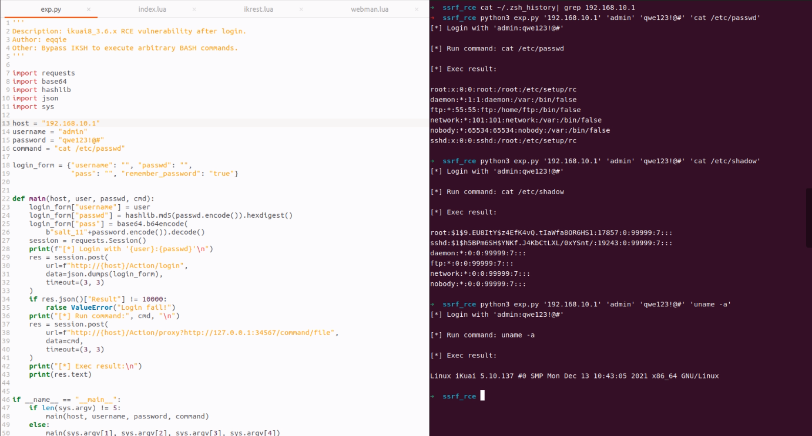

## iKuai OS (post-auth) RCE

### desc

A post-authentication arbitrary command execution vulnerability exists in the iKuaiOS soft routing system, which allows an attacker to execute arbitrary shell commands via network requests. Since the product does not open the system shell, the command execution could lead to source code disclosure and further infiltration attacks.

### version

Before 3.6.8

### cve id

CVE-2022-40469

### poc

`python3 exp.py '192.168.10.1' 'admin' 'qwe123!@#' 'uname -a'`

